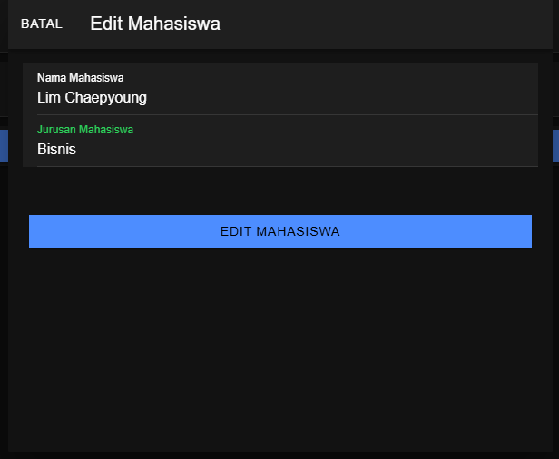

# Penjelasan Proses CRUD
Ini adalah tampilan awal program.

## 1. Create (Tambah Data)

- Pada proses ini, user bisa menambahkan data mahasiswa baru dengan mengisi form yang sudah tersedia.

- Setelah mengisi nama dan jurusan, tekan tombol "Tambah Mahasiswa" untuk menyimpan data baru ke dalam sistem.

## 2. Read (Lihat Data)

- Data mahasiswa yang sudah ditambahkan akan ditampilkan dalam bentuk daftar di halaman awal.
- Setiap entri menampilkan nama dan jurusan mahasiswa.

## 3. Update (Edit Data)

- Ini adalah sebuah proses yang memungkinkan user mengubah data mahasiswa.
- Pilih tombol "Edit" pada data mahasiswa yang ingin diperbarui, kemudian lakukan perubahan, terakhir tekan tombol "Edit Mahasiswa" untuk menyimpan perubahannya.

## 4. Delete (Hapus Data)

- Dalam proses hapus data terdapat konfirmasi penghapusan.
- Saat tombol "Hapus" ditekan, sistem akan memunculkan alert berisi pesan "Apakah Data ingin dihapus?" dan pilihan "Ya" atau "Tidak".
- Jika user memilih "Tidak", maka akan kembali ke halaman awal.
- Jika user memilih "Ya", maka data akan dihapus dari sistem.
  

---
## Hasna Mumtazah Khairunnisa - H1D022070 - Shift E
